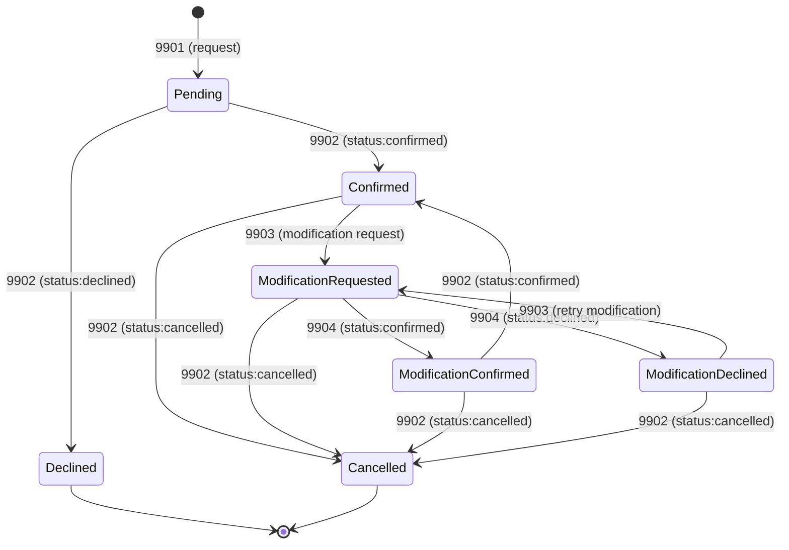

# Reservation State Machine

This document describes the state machine for restaurant reservation threads in the AI Concierge application, following the NIP-RR protocol.

## Overview

Reservation threads progress through a series of well-defined states based on messages exchanged between the customer (user) and the restaurant. Each state transition is triggered by a specific message type as defined in NIP-RR.

## State Diagram

## States

### Pending (sent)
- **Triggered by**: Customer sends `kind:9901` reservation request
- **Description**: Initial state after customer submits a reservation request
- **UI Label**: "Pending"
- **Next States**: Confirmed, Declined

### Confirmed (confirmed)
- **Triggered by**: Restaurant sends `kind:9902` with `status:confirmed`
- **Description**: Restaurant has confirmed the reservation
- **UI Label**: "Confirmed"
- **Next States**: ModificationRequested, Cancelled

### Declined (declined)
- **Triggered by**: Restaurant sends `kind:9902` with `status:declined`
- **Description**: Restaurant has declined the reservation (terminal state)
- **UI Label**: "Declined"
- **Next States**: None (terminal)

### ModificationRequested (modification_requested)
- **Triggered by**: Restaurant sends `kind:9903` modification request
- **Description**: Restaurant proposes a different time/party size
- **UI Label**: "Modification Requested"
- **Next States**: ModificationConfirmed, ModificationDeclined, Cancelled

### ModificationConfirmed (modification_confirmed)
- **Triggered by**: Customer sends `kind:9904` with `status:confirmed`
- **Description**: Customer accepts the restaurant's proposed modification
- **UI Label**: "Modification Confirmed"
- **Next States**: Confirmed (awaiting final restaurant confirmation), Cancelled

### ModificationDeclined (modification_declined)
- **Triggered by**: Customer sends `kind:9904` with `status:declined`
- **Description**: Customer declines the restaurant's proposed modification
- **UI Label**: "Modification Declined"
- **Next States**: ModificationRequested (restaurant can propose alternative), Cancelled

### Cancelled (cancelled)
- **Triggered by**: Either party sends `kind:9902` with `status:cancelled`
- **Description**: Reservation has been cancelled (terminal state)
- **UI Label**: "Cancelled"
- **Next States**: None (terminal)

## Message Types (NIP-RR)

### kind:9901 - Reservation Request
- Sent by: Customer
- Content: `{ party_size, iso_time, notes? }`
- Creates: New reservation thread
- Transitions: [*] → Pending

### kind:9902 - Reservation Response
- Sent by: Restaurant
- Content: `{ status, iso_time?, message? }`
- Status values: `confirmed`, `declined`, `expired`, `cancelled`
- Transitions: 
  - Pending → Confirmed/Declined
  - ModificationConfirmed → Confirmed
  - Any → Cancelled

### kind:9903 - Modification Request
- Sent by: Restaurant
- Content: `{ party_size?, iso_time?, notes? }`
- Transitions: Confirmed → ModificationRequested

### kind:9904 - Modification Response
- Sent by: Customer
- Content: `{ status, iso_time?, message? }`
- Status values: `confirmed`, `declined`
- Transitions:
  - ModificationRequested → ModificationConfirmed (if confirmed)
  - ModificationRequested → ModificationDeclined (if declined)

## Key Points

1. **Status Determination**: The status of a reservation is determined by the **last** unsigned rumor message within the thread, ordered by `created_at` timestamp

2. **Time Resolution**: The primary reservation time is determined by:
   - Latest confirmed `kind:9902` message with `iso_time`, OR
   - Latest confirmed `kind:9904` message with `iso_time`, OR
   - Original `kind:9901` request `iso_time` (fallback)

3. **Terminal States**: `Declined` and `Cancelled` are terminal states - no further transitions are possible

4. **Modification Flow**: After a customer accepts a modification (`kind:9904` with `status:confirmed`), the restaurant must send a final `kind:9902` confirmation to complete the cycle

5. **Message Ordering**: Messages are processed in order by `created_at` timestamp (ascending). If timestamps are identical, lexicographic comparison of message `id` is used

## Implementation Details

The state machine is implemented in `ReservationContext.tsx`:
- State transitions occur in the `updateThreadWithMessage` function
- Status is stored in the `ReservationThread.status` field
- Each message is validated before processing
- Message ordering ensures consistent state transitions

## UI Display Rules

Per Guidance.md, the Reservations tab displays only:
- Reservations with **future dates**
- Reservations with status: **Sent**, **Confirmed**, **Modification Requested**, or **Modification Confirmed**
- Past reservations and declined/cancelled reservations are filtered out

## References

- **Guidance.md**: `/internal/Guidance.md` - Complete reservation handling specification
- **NIP-RR Protocol**: https://github.com/Synvya/nip-rr/blob/main/NIP-RR.md
- **Implementation**: `frontend/src/contexts/ReservationContext.tsx`

